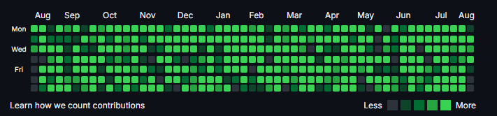
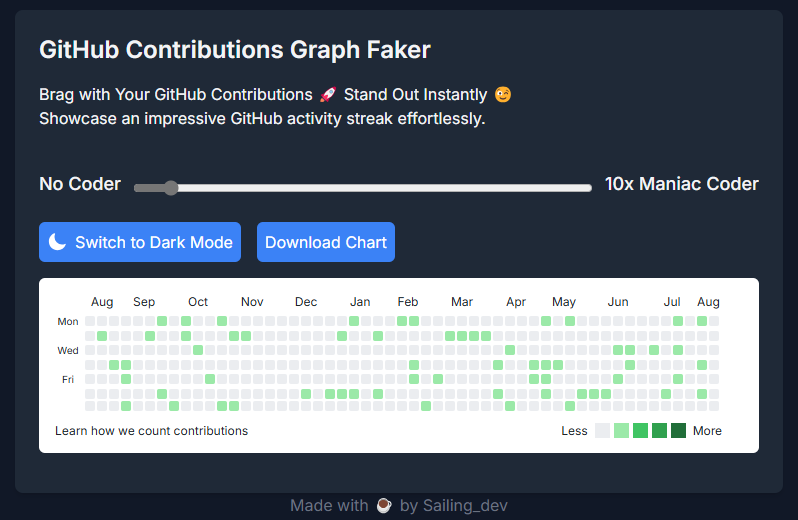

# Fake GitHub Contribution Generator

This open-source project is built with [Next.js](https://nextjs.org/) and allows users to generate fake GitHub contribution charts. You can customize the chart's contribution frequency and appearance. It's a fun tool to visualize and experiment with GitHub contribution graphs without affecting real accounts.


## Demo

[Live Demo](https://github-contributions-faker.vercel.app/)



## Getting Started

To get a local copy up and running, follow these steps:

## Installation

    Clone the repository:

```bash
git clone https://github.com/kellerfabian/contributionfaker.git
cd contributionfaker
npm install
npm run dev
```

Open http://localhost:3000 to view the project in your browser.
Building for Production

# Contributing

Contributions are what make the open-source community such an amazing place to learn, inspire, and create. Any contributions you make are greatly appreciated.

- Fork the Project
- Create your Feature Branch (git checkout -b feature/AmazingFeature)
- Commit your Changes (git commit -m 'Add some AmazingFeature')
- Push to the Branch (git push origin feature/AmazingFeature)
- Open a Pull Request

# License

Distributed under the MIT License. See LICENSE for more information.
Contact

KellerFabian - @sailing_dev
